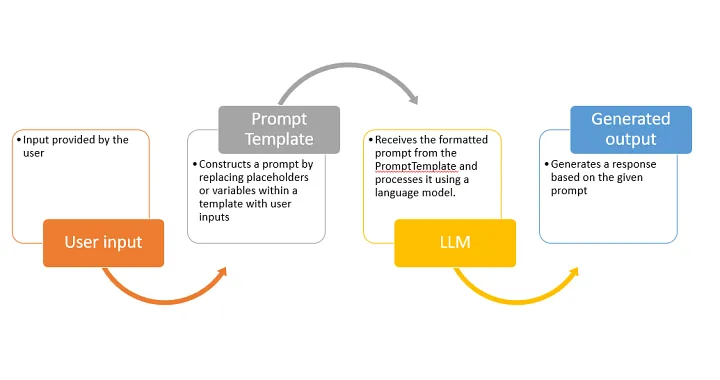
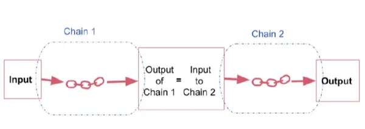
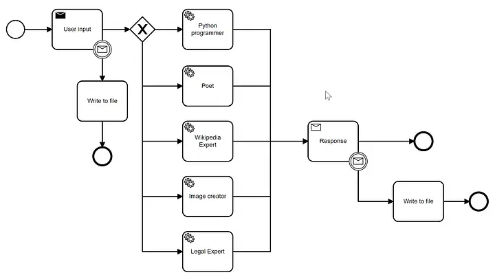
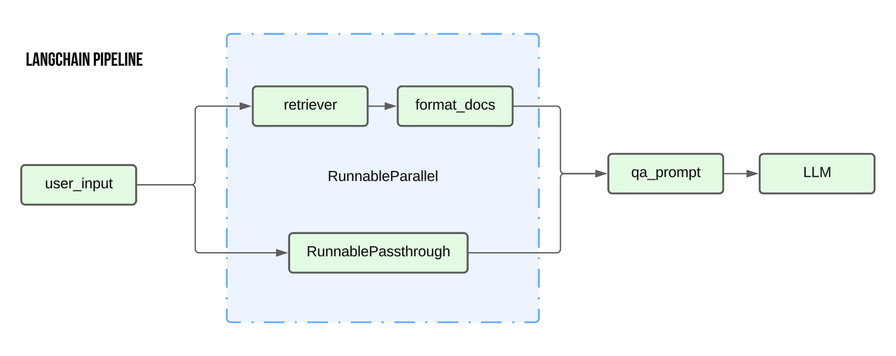

## What are Chains in LangChain?

A chain is a sequence of calls/automated actions/operations, whether those calls are to LLMs, external tools, or data preprocessing/postprocessing steps.
Chains enable you to go beyond simple LLM interactions; they allow you to construct pipelines that combine different models and functionalities (External data, external API calls).
By chaining components, you create powerful applications that can leverage the strengths of LLMs or integrate external data and services.

## References

https://medium.com/@zshariff70/langchain-simple-llm-chains-in-action-bda6950afc71

## Types of Chains in LangChain

### Simple Chain

The most basic type of chain simply takes your input, formats it with a prompt template, and sends it to an LLM for processing.

### Sequential Chain

A series of steps executed in order. The output of one component or LLM becomes the input for the next step in the chain. This is useful for:
Breaking down complex tasks into smaller, manageable units.
Combining the capabilities of multiple LLMs.

### Conditional Chain (also known as Router Chain/Branching Chain)

Act as intelligent decision-makers, directing inputs to specific sub-chains based on certain conditions. This is useful for scenarios where you need to selectively apply different LLM models or tools depending on the nature of the input.

### Parallel Chain

